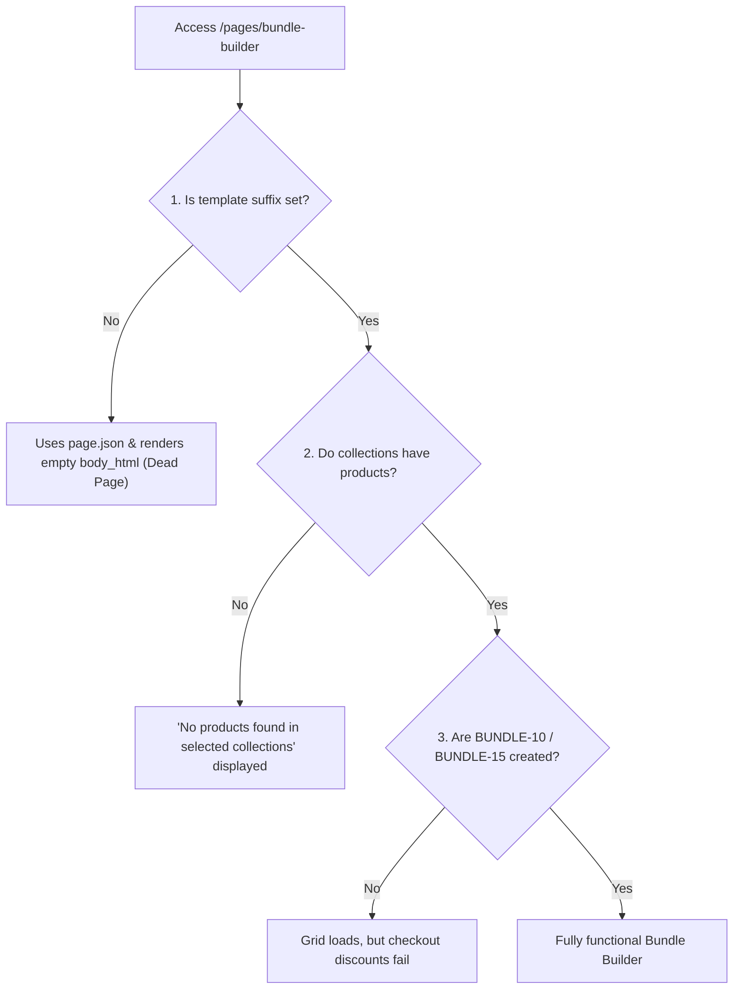

# Storefront Issues Audit Log

This document consolidates and describes all identified issues, code comments, and architectural gaps in the `xinzuo-theme-snapshot` repository.

---

## 🛠️ Confirmed Storefront & Setup Issues

### 1. Bundle Builder Page is Dead / Empty
*   **Location**: [seed-to-dev-store.mjs:L359](file:///c:/Users/Lenovo/Desktop/temp/project/xinzuo-theme-snapshot/scripts/seed-to-dev-store.mjs#L359), [seed.json:L16596-L16598](file:///c:/Users/Lenovo/Desktop/temp/project/xinzuo-theme-snapshot/seed.json#L16596-L16598)
*   **Root Cause**: The setup script seeds pages using the Shopify REST API without specifying the `template_suffix` attribute. Consequently, the pages default to standard templates (`templates/page.json`) and display the blank `body_html` instead of loading the custom sections defined in [page.bundle-builder.json](file:///c:/Users/Lenovo/Desktop/temp/project/xinzuo-theme-snapshot/templates/page.bundle-builder.json).

### 2. Bundle Discount Codes Missing
*   **Location**: [page.bundle-builder.json:L112](file:///c:/Users/Lenovo/Desktop/temp/project/xinzuo-theme-snapshot/templates/page.bundle-builder.json#L112)
*   **Root Cause**: The theme template refers to discount codes `BUNDLE-10` and `BUNDLE-15`. These are not seeded in the dev store by any script, meaning checkout will fail to apply discounts if these codes are not manually created in the Shopify Admin.

### 3. Best Sellers Page has Broken Images
*   **Location**: [seed.json:L16591-L16593](file:///c:/Users/Lenovo/Desktop/temp/project/xinzuo-theme-snapshot/seed.json#L16591-L16593), [page.best-sellers.json:L59-L67](file:///c:/Users/Lenovo/Desktop/temp/project/xinzuo-theme-snapshot/templates/page.best-sellers.json#L59-L67)
*   **Root Cause**: 
    1. The page's `body_html` is seeded with empty `` tags (`
...
`).
    2. The featured products slider in the template (`home_products_a8Rg8q`) contains an empty products array (`"products": []`).

### 4. Third-Party App Blocks Pruned on Push
*   **Location**: [push-theme.mjs:L152-L189](file:///c:/Users/Lenovo/Desktop/temp/project/xinzuo-theme-snapshot/scripts/push-theme.mjs#L152-L189)
*   **Root Cause**: The function `pruneAppBlocks()` deletes all blocks starting with `shopify://apps/` (Judge.me, Klaviyo, Rokt) during theme upload to prevent schema verification failures on development stores without those apps installed.

### 5. Shoplift Snippet is Dead
*   **Location**: [shoplift.liquid:L4](file:///c:/Users/Lenovo/Desktop/temp/project/xinzuo-theme-snapshot/snippets/shoplift.liquid#L4)
*   **Root Cause**: It relies on shop metafields (`{{ shop.metafields.shoplift.snippet.value }}`) which are never created or seeded in the development store.

### 6. Product Videos Missing
*   **Location**: [push-theme.mjs:L141-L142](file:///c:/Users/Lenovo/Desktop/temp/project/xinzuo-theme-snapshot/scripts/push-theme.mjs#L141-L142)
*   **Root Cause**: Video references (`shopify://files/*`) are explicitly stripped from settings during theme push as video assets are removed due to packaging limits.

### 7. Temporary Blank Images on First Load
*   **Location**: [seed-to-dev-store.mjs:L317](file:///c:/Users/Lenovo/Desktop/temp/project/xinzuo-theme-snapshot/scripts/seed-to-dev-store.mjs#L317)
*   **Root Cause**: Shopify processes newly uploaded media files asynchronously, meaning images might show as blank placeholders immediately after setup until Shopify finishes processing.

---

## 🪵 Bundle Builder Failure Flow

The Bundle Builder relies on three layered conditions to work. Currently, all three are broken on fresh seed:

---

## 🐛 Known Code Bugs & Performance Fixes (Documented in Code Comments)

| Issue | File & Location | Technical Details |
| :--- | :--- | :--- |
| **iOS Safari Header Flicker** | [header.js:L136-L150](file:///c:/Users/Lenovo/Desktop/temp/project/xinzuo-theme-snapshot/assets/header.js#L136-L150) | Throttled layout reads/writes using `requestAnimationFrame` to prevent forced reflows 60+ times/sec on scroll. |
| **Quick-add Dialog UI Freeze** | [quick-add.js:L254-L273](file:///c:/Users/Lenovo/Desktop/temp/project/xinzuo-theme-snapshot/assets/quick-add.js#L254-L273) | Workaround for iOS <16.4 by slightly adjusting results grid width by `1px` and reverting it inside nested RAF calls on close. |
| **Safari <16.4 Outline Radius** | [variant-main-picker.liquid:L434-L456](file:///c:/Users/Lenovo/Desktop/temp/project/xinzuo-theme-snapshot/snippets/variant-main-picker.liquid#L434-L456) | CSS fallback using `@supports not` to draw focus outlines using pseudo-elements `::after` since outlines ignore `border-radius` on older Safari engines. |
| **Product Card Overflow Counter** | [product-card.js:L149-L174](file:///c:/Users/Lenovo/Desktop/temp/project/xinzuo-theme-snapshot/assets/product-card.js#L149-L174) | Dispatches a custom `reflow` event on `overflow-list` inside `requestAnimationFrame` to trigger correct count recalculations upon variant switches. |
| **Slideshow Tap-and-Drag** | [slideshow.js:L701-L709](file:///c:/Users/Lenovo/Desktop/temp/project/xinzuo-theme-snapshot/assets/slideshow.js#L701-L709) | Triggers `onPointerUp` cleanup on `pointerdown` and `pointercancel` to stop unintended slide shifts on first pointer-move captures. |

---

## 🔍 Suggested Audit & Optimization Areas

According to the developer notes, the following components contain technical debt or UX edge cases:

*   **Performance**: Optimize Swiper carousels, defer render-blocking JavaScript, leverage image preloading (`rel="preload"`), and refine font loading parameters.
*   **Cart Drawer**: Verify mobile interaction, add/remove behaviors, empty state display, and quantity selector zero-out inputs.
*   **Navbar / Header**: Ensure focus traps work in the mobile drawer, dropdown delay timers are reliable, and sticky headers don't cause layout shifting.
*   **PDP (Product Details Page)**: Review variant selector updates, thumbnails gallery responsiveness, structured product schema (JSON-LD), and add-to-cart success feedback.
*   **Collection Filters**: Check mobile filter drawer visibility, sorting changes speed, and empty state search result placeholders.
*   **Accessibility (a11y)**: Focus indicator rings contrast on dark background, screen-reader labels on buttons/inputs, and keyboard navigation tab indexing.
*   **SEO / Structured Data**: Fix broken canonical tags, optimize OpenGraph images, and verify meta page titles structure.
